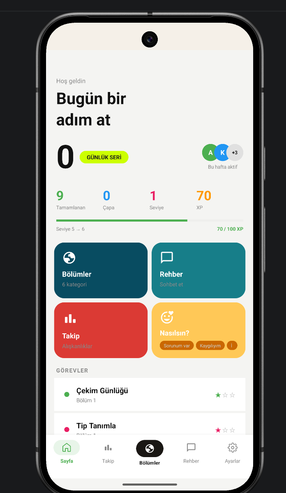
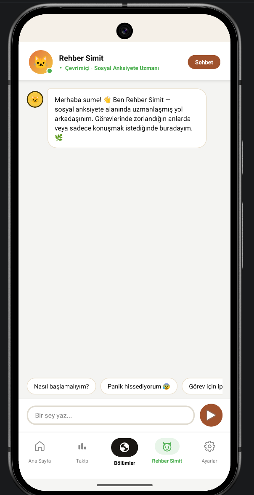
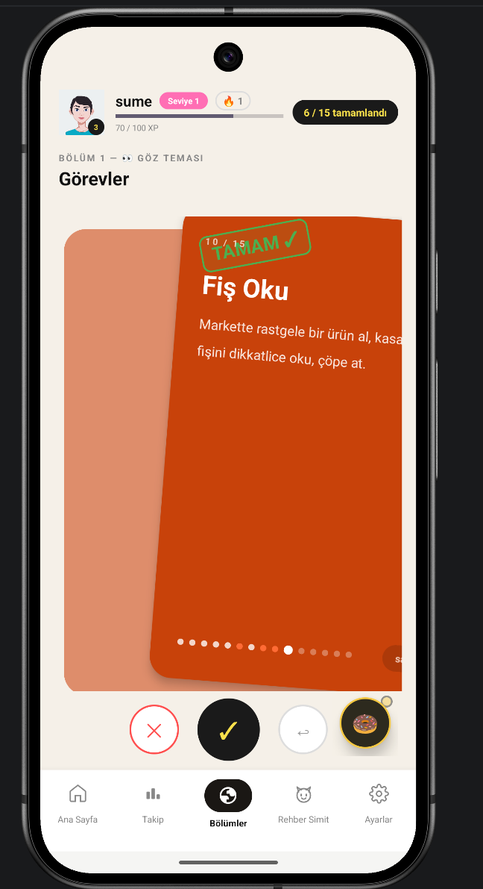
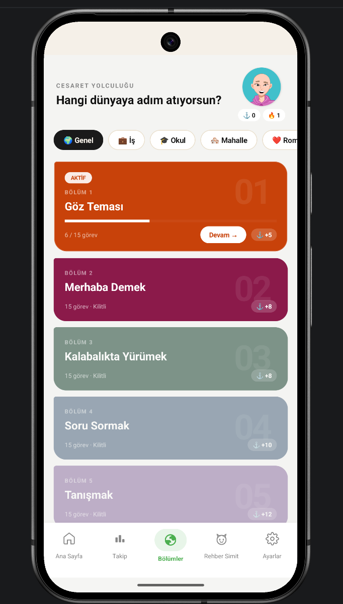
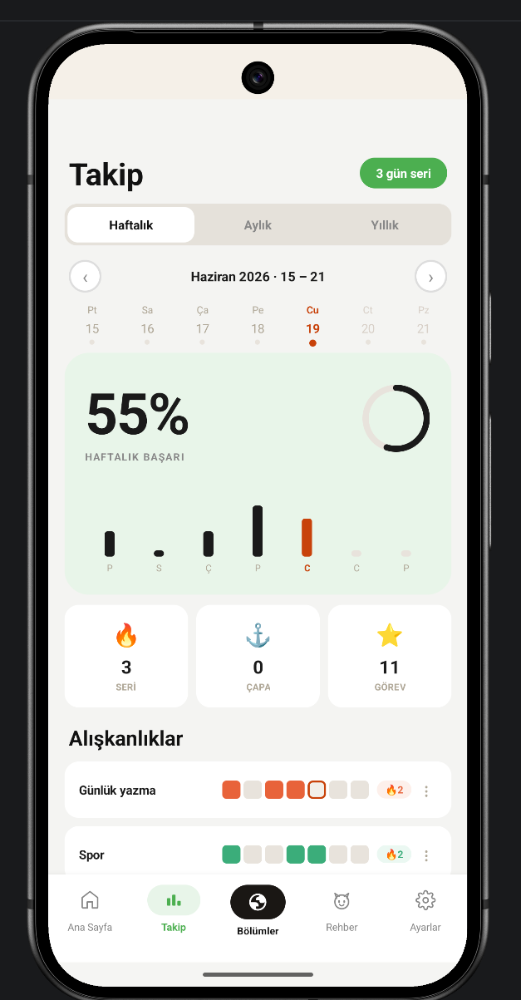

# Social Anxiety Helper 🧠

An Android application designed to support users in managing social anxiety through interactive exercises, progress tracking, and an AI-powered assistant.

## 📱 Features

- User onboarding flow
- Personalized user experience
- Anxiety support activities
- Progress tracking system
- Level-based development map
- Worlds and tracking system
- Profile management
- AI assistant integration
- Firebase-based data management

## 🤖 AI Integration

The application includes an AI chatbot feature that provides conversational support and guidance.

The AI assistant is integrated using an external API to create interactive conversations and support users throughout their experience.

## 🛠 Technologies

- Java
- Kotlin
- Android Studio
- XML
- Firebase Authentication
- Firebase Firestore
- Gradle
- AI API Integration

## 📂 Project Structure
app/
└── src/
└── main/
├── java/
│ └── com.example.socialanxietyhelper
│
├── res/
│ ├── drawable
│ ├── layout
│ ├── menu
│ ├── mipmap
│ ├── values
│ └── xml
│
├── assets
└── AndroidManifest.xml

## 📸 Screenshots

### 🏠 Home Screen

### 🤖 AI Chat Assistant

### 📊 Level Map

### 🌎 Worlds

### 📈 Tracking

## 🎯 Purpose

The goal of this project is to create a supportive mobile experience that helps users practice coping strategies, track progress, and build confidence through structured interactions.

The application focuses on combining technology, user experience, and interactive features to create an engaging support environment.

## 🚀 Future Improvements

- More personalized AI responses
- Additional anxiety exercises
- Advanced progress analytics
- Notification reminders
- More customization options

## 👩‍💻 Developer

Ayşe Nida Akkuş